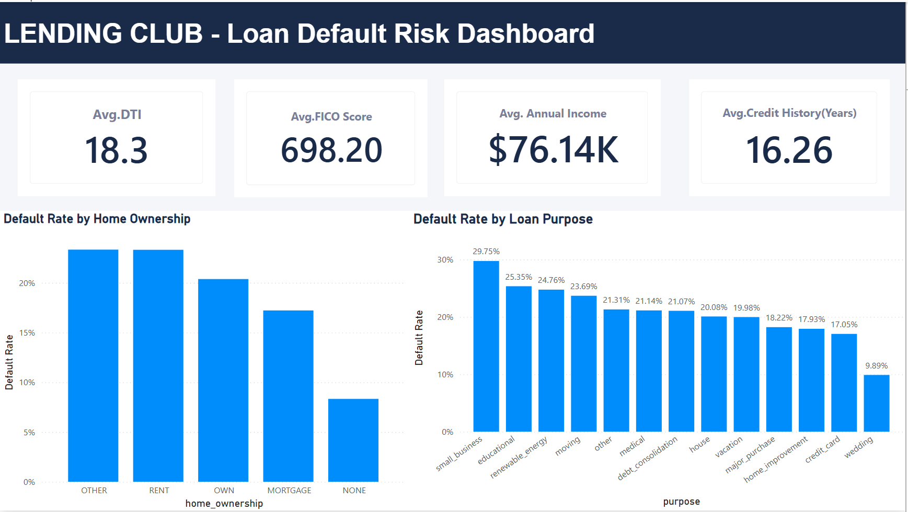
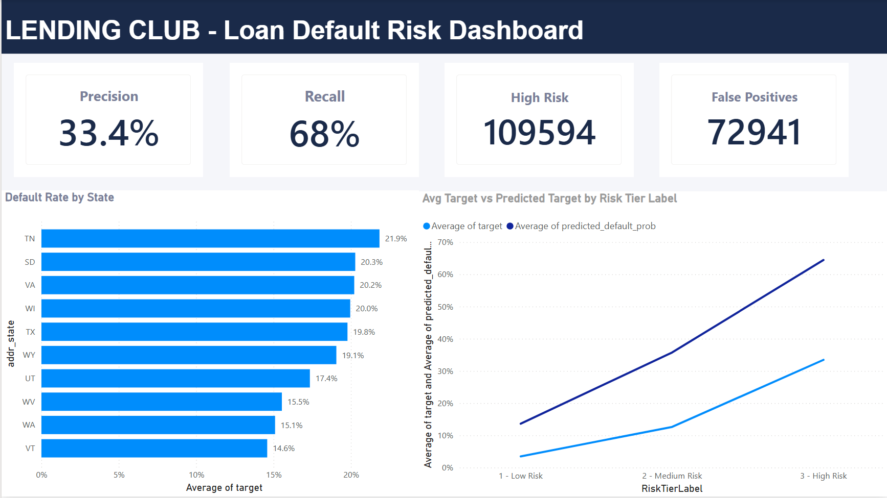

# Lending Club Loan Default Risk Prediction

Predicting whether a loan will default or be fully repaid, using only information
available at the time of loan approval — built as an end-to-end data analytics
portfolio project (Python + Power BI).

## Problem Statement

Can we predict, at the moment someone applies for a loan, whether they are likely
to default or pay it back in full? This is framed as a binary classification
problem using the Lending Club accepted-loans dataset (~1.35M resolved loans after
cleaning), with a strict rule that only information available at approval time is
used as a model input — protecting against data leakage from post-origination
fields like payment history or collections data.

## Data Source

[Kaggle — Lending Club Loan Data](https://www.kaggle.com/datasets/wordsforthewise/lending-club)
(`accepted_2007_to_2018Q4.csv.gz`). The raw file (~2GB) is not included in this
repo due to size — download it directly from Kaggle to reproduce the notebook.

## What's in this repo

- **`Notebooks/`** — full Python pipeline: data cleaning, leakage removal, feature
  engineering, Logistic Regression and XGBoost models, evaluation
- **`Dashboards/`** — screenshots of the 3-page Power BI dashboard built from the
  model's test-set predictions
- **`requirements.txt`** — Python packages needed to run the notebook

## Approach

1. Defined the target variable (Fully Paid vs Charged Off/Default) from `loan_status`
2. Removed all post-origination data leakage columns
3. Cleaned and engineered features (e.g. credit history length from raw dates)
4. Compared a Logistic Regression baseline against XGBoost
5. Ran a follow-up experiment to check whether the model depends on Lending Club's
   own risk grade
6. Exported test-set predictions and built a 3-page Power BI dashboard

## Results

| Model | ROC-AUC | Precision | Recall |
|---|---|---|---|
| Logistic Regression | 0.649 | 0.28 | 0.61 |
| XGBoost | 0.735 | 0.33 | 0.68 |

Removing Lending Club's own `grade`/`sub_grade` from the model caused almost no
drop in performance (0.7350 → 0.7335 AUC) — showing the model can independently
reconstruct an equivalent risk signal from raw borrower attributes, rather than
simply relying on the lender's own existing score.

## Dashboard

Three pages, built from the model's test-set predictions. The `.pbix` file itself
is not included in this repo; screenshots below capture the full dashboard content.

### Portfolio Overview

### Borrower Risk Profile

### Model Performance & Geography

## Key Insight

The model ranks risk correctly (validated by ROC-AUC) but is under-confident in
its predicted probabilities, especially for high-risk loans — a calibration issue
rather than a ranking issue, visible in the Predicted vs. Actual chart on the
Model Performance page.

## Tech Stack

Python (pandas, scikit-learn, XGBoost), Jupyter Notebook, Power BI
